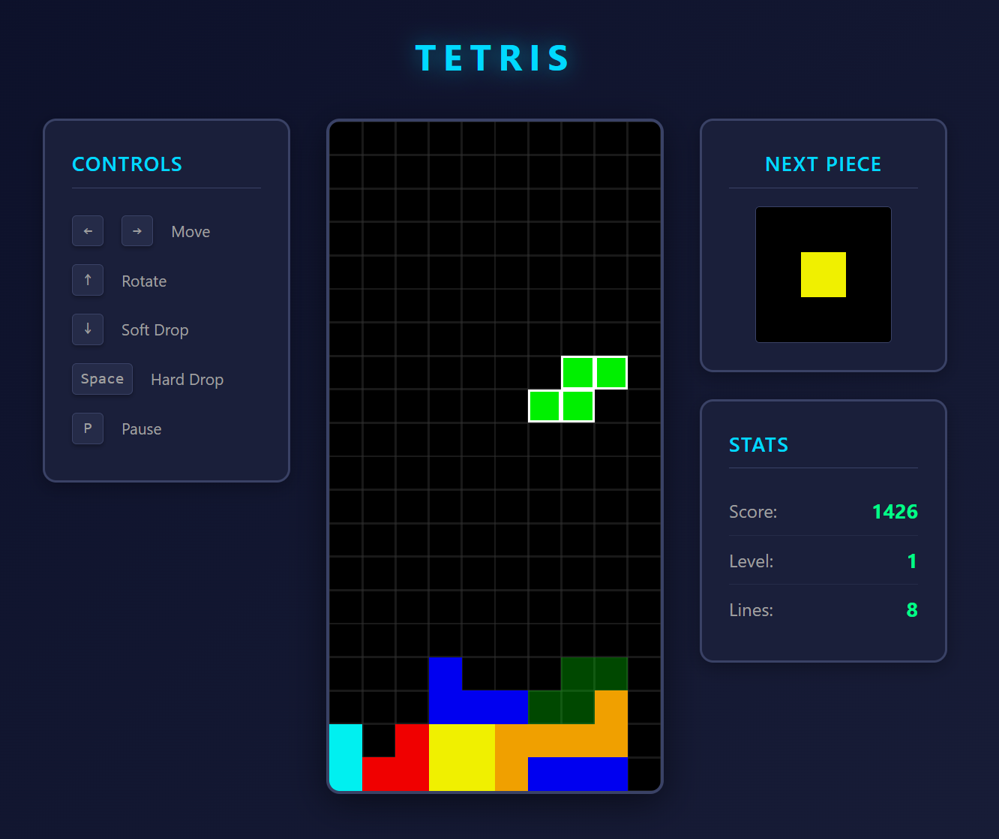

# Tetris Game

Classic Tetris game built with vanilla JavaScript, HTML5 Canvas, and CSS3. No frameworks, no dependencies (except dev tools).



## Features

- 🎮 **Classic Tetris gameplay** with 7 tetromino pieces
- 🎯 **Super Rotation System (SRS)** with wall-kicks for advanced rotation
- 👻 **Ghost piece** showing where the active piece will land
- 💥 **Particle explosion animations** for line clears with special TETRIS effect (4 lines)
- 📊 **Progressive difficulty** with level system (increases every 10 lines)
- 🎨 **Next piece preview** with 7-bag randomization
- ⏸️ **Pause/resume** functionality
- ⌨️ **Keyboard-only controls** with intuitive layout
- 🎪 **Smooth 60 FPS gameplay** with requestAnimationFrame
- 📱 **Responsive desktop UI** with left sidebar controls
- 🎵 **Score tracking** with level progression and lines cleared

## Quick Start

### Prerequisites

- Node.js 16+ and npm 7+
- Modern browser (Chrome 90+, Firefox 88+, Safari 14+, Edge 90+)

### Installation

```bash
# Install dependencies
npm install

# Start development server
npm run serve
```

Open `http://localhost:3000` in your browser.

### Development

```bash
# Run tests
npm test

# Run tests in watch mode
npm run test:watch

# Check test coverage
npm run test:coverage

# Lint code
npm run lint

# Fix linting issues
npm run lint:fix

# Format code with Prettier
npm run format
```

## Controls

| Key   | Action                        |
| ----- | ----------------------------- |
| ← →   | Move piece left/right         |
| ↑     | Rotate piece clockwise        |
| ↓     | Soft drop (faster fall)       |
| Space | Hard drop (instant placement) |
| P     | Pause/resume game             |

## Game Rules & Mechanics

### Scoring

Clear complete horizontal lines to score points. Clearing multiple lines at once awards bonus points:

- **1 line (Single)**: 100 × level
- **2 lines (Double)**: 300 × level
- **3 lines (Triple)**: 500 × level
- **4 lines (Tetris)**: 800 × level 💥 *Special particle effect!*

### Progression

- Level increases every 10 lines cleared
- Fall speed increases with each level using gravity formula: `(0.8 - ((level - 1) * 0.007))^(level - 1)`
- Game ends when pieces reach the top of the board (row 0)

### Piece Randomization

Uses **7-bag randomization** (Tetris Guideline standard):
- All 7 tetromino types appear once per bag
- No piece repeats until all 7 have been drawn
- Ensures fair distribution and prevents long droughts

### Visual Enhancements

- **Ghost Piece**: Transparent preview shows exactly where the active piece will land
- **Line Clear Animation**: Physics-based particle explosions when lines are cleared
- **TETRIS Special Effect**: Clearing 4 lines triggers enhanced explosion with 8 particles per cell, increased speed, rotation effects, and longer duration (900ms)

## Project Structure

```
tetris-game/
├── index.html          # Main HTML file
├── css/
│   ├── main.css        # Global styles
│   ├── board.css       # Game board styles
│   └── ui.css          # UI panel styles
├── js/
│   ├── main.js         # Entry point
│   ├── game-engine.js  # Game loop & orchestration
│   ├── board.js        # Board state & logic
│   ├── tetromino.js    # Piece shapes & rotation
│   ├── piece-queue.js  # Piece randomization
│   ├── state.js        # Score, level, lines tracking
│   ├── input.js        # Keyboard input handling
│   ├── renderer.js     # Canvas rendering
│   └── utils.js        # Constants & utilities
└── tests/
    ├── unit/           # Unit tests
    ├── integration/    # Integration tests
    └── contract/       # API contract tests
```

## Technology Stack

- **JavaScript**: ES6+ modules, classes, arrow functions (no transpilation)
- **HTML5**: Canvas API for 2D rendering
- **CSS3**: Grid, Flexbox, CSS Custom Properties
- **Testing**: Jest 29+ with jsdom (98 tests across 6 suites)
- **Code Quality**: ESLint (Airbnb config), Prettier
- **Animation**: RequestAnimationFrame with custom particle physics engine

### Test Coverage

- ✅ **98 tests passing**
- **Contract tests**: API specifications for Board, Tetromino, Game Engine
- **Unit tests**: Individual module behavior
- **Integration tests**: End-to-end gameplay scenarios

## Performance

- 60 FPS sustained frame rate
- <50ms input latency
- <100ms line clear processing
- <1.5s First Contentful Paint (FCP)
- <3.5s Time to Interactive (TTI)

## Browser Support

- Chrome 90+
- Firefox 88+
- Safari 14+
- Edge 90+

ES6+ features required (no transpilation for production).

## License

MIT

## Credits

Based on the Tetris Guideline (2009) for standard gameplay mechanics.
